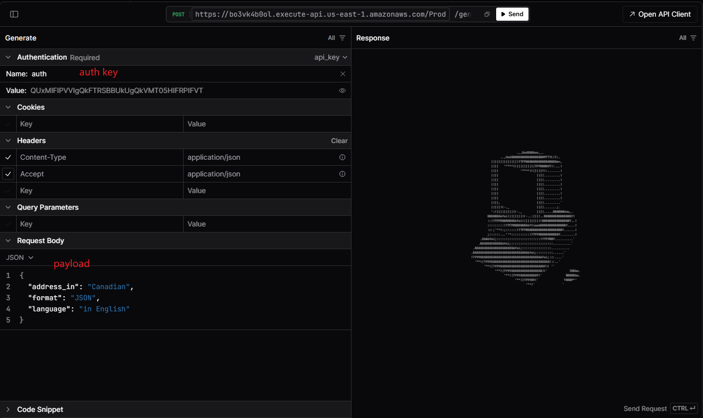
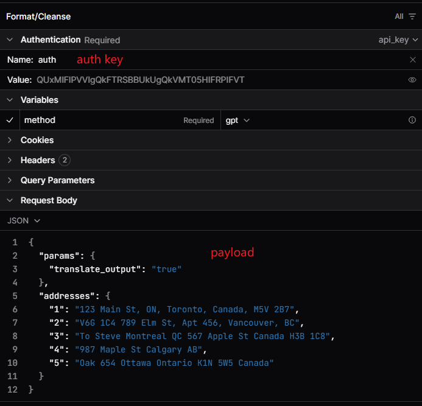

# Address Cleansing Demo
A practical demonstration of using AI to parse and normalize address data.

## Project goals

- Primary goals:
  - Implement secure HTTPS endpoints with AWS API Gateway and AWS Lambda.
  - Use OpenAPI as the source of truth to align frontend and backend API contracts.
  - 
- Secondary goals:
  - Use OpenAI API to parse raw or incomplete addresses and return standardized output.

## Intended scope

- Large-scale address parsing via generic LLM providers is generally not cost-effective; this project is intended as a learning exercise for API Gateway + Lambda and to explore whether LLM-based address normalization is feasible.
- A better production approach may be fine-tuning a smaller, dedicated internal model for address parsing and deploying it behind a secure corporate service.

## Repository structure

- /src
  - /addrgen: generates test addresses in random or unstructured formats.
  - /auth: authentication support for API Gateway.
  - /cleansing: core address normalization logic.
- /swagger: OpenAPI definitions and API docs (importable into tools like Swagger UI); this project uses [Scalar](https://dashboard.scalar.com/).
- /tests
  - data, integration, unit: not yet implemented.
  - aws_request.http: example HTTP requests for use with [humao.rest-client](https://marketplace.visualstudio.com/items?itemName=humao.rest-client).
- /bld_dply.sh: deploy to AWS; copy AWS credentials from `prod.env` to `.env` before running.
- /delete_stack.sh: remove deployed stack.
- /prepare_sam_template.py, /template_template.yaml: script to substitute values in `openapi.yaml`, inject into `template_template.yaml`, and generate `template.yaml` for SAM deployments.
- /update_apidoc.sh: call Scalar CLI to refresh OpenAPI docs.

## Deployment and development workflow

- Recommended starter path: use DevContainer for a reproducible local development and deploy environment.
- After setting up `.env`, run `bld_dply.sh` to deploy. It prints API Gateway output, including the generated stage URL host id, e.g.:
```
Key             ApiGatewayStageURL
Description     API Gateway
Value           7sa5q09h0c  <-- hostname
```
- Example base URL:
  - `https://7sa5q09h0c.execute-api.us-east-1.amazonaws.com/Prod`

## Expected behavior

- Generate randomized or messy address inputs.
  - 
```json
# Address generation payload exmaple
{
  "address_in": "Canadian",
  "format": "JSON",
  "language": "in English"
}

# response
{
  "1": "123 Main St, ON, Toronto, Canada, M5V 2B7",
  "2": "V6G 1C4 789 Elm St, Apt 456, Vancouver, BC",
  "3": "To Steve Montreal QC 567 Apple St Canada H3B 1C8",
  "4": "987 Maple St Calgary AB",
  "5": "Oak 654 Ottawa Ontario K1N 5W5 Canada"
}
```

- Normalize and decompose those addresses into structured fields.
  - 
```json
# Cleansing payload exmaple
{
  "params": {
    "translate_output": "true"
  },
  "addresses": {
    "1": "123 Main St, ON, Toronto, Canada, M5V 2B7",
    "2": "V6G 1C4 789 Elm St, Apt 456, Vancouver, BC",
    "3": "To Steve Montreal QC 567 Apple St Canada H3B 1C8",
    "4": "987 Maple St Calgary AB",
    "5": "Oak 654 Ottawa Ontario K1N 5W5 Canada"
  }
}

# response
{
  "seq": 1,
  "result": {
    "original": "string",
    "cleansed": {
      "apartment_number": "string",
      "street_number": "string",
      "street_name": "string",
      "province": "string",
      "country": "string",
      "postcode": "string"
    }
  }
},{
  "seq": 2,
  "result": {
    "original": "string",
    "cleansed": {
      "apartment_number": "string",
      "street_number": "string",
      "street_name": "string",
      "province": "string",
      "country": "string",
      "postcode": "string"
    }
  }
}, ...

```

## Notes

- Running SAM in local mode inside DevContainer can fail due to Docker-in-Docker limitations.
- For the same reason, `sam build --container` may fail; use plain `sam build`.

## Prompts
- Generate sample addresses with varied formats:
  - `Please provide three Canadian addresses in English, including apartment or street numbers, street names, provinces, country, postal codes, and any other relevant information. Please feel free to mix up the format and leave out some details to simulate realistic handwriting. Each address should be written on a separate line.`
- Normalize the addresses from step 1:
  - `Please provide the address details in the following format: Number, Street or District, City, Province, Country, and Postcode. The output should be in JSON format: [{},{}]`
